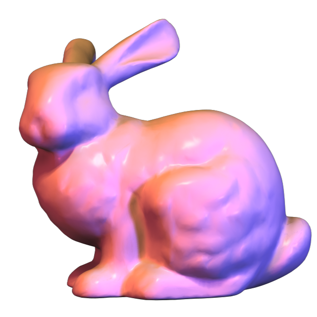
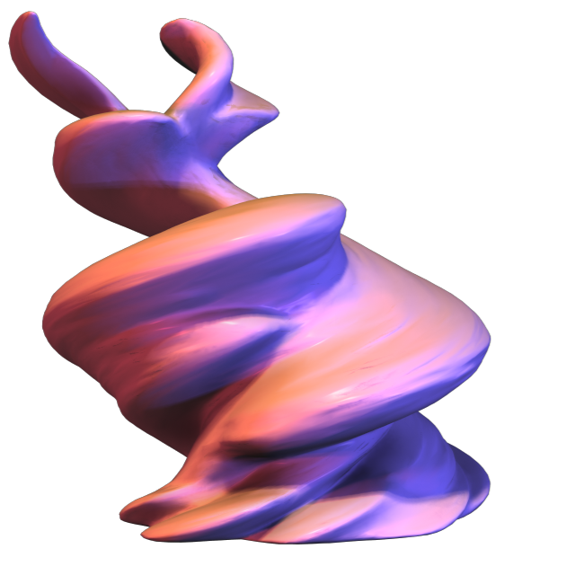

A demonstration of world-space normal deformation/computation techniques using geometry shaders, implemented in Derivative Touchdesigner 64-Bit Build 2018.23470. https://www.derivative.ca

Created for a talk given at TouchIn NYC May 2018, presented by Volvox Labs http://volvoxlabs.com and LiveX https://livex.tv/

Includes a real-time GPU accelerated "smooth" per vertex normal computation technique that I developed by emulating common CPU based methods for computing vertex normals for triangulated meshes.

This allows for non-uniform scaling and twisting / warping of the mesh while retaining smooth surface lighting.

Face normals and Vertex normals are both naively calculated here in a single shader pass using a nested loop for adjacent triangles.

A two pass method would be more efficient, but perhaps convoluted within TouchDesigner's standard render pipeline for MATs / Materials.

This could also be adapted to a vertex shader only approach with the proper vertex attributes, or adapted to other OpenGL based engines/implementations. 

Special Thanks: 

Vincent Houzé http://vincenthouze.com  
Elburz Sorkhabi http://elburz.io  
Matthew Ragan http://matthewragan.com  

  
Stanford Bunny (No deformation with smooth vertex normals.)  
  
  
Stanford Bunny (Twisted on Y axis with smooth vertex normals.)
